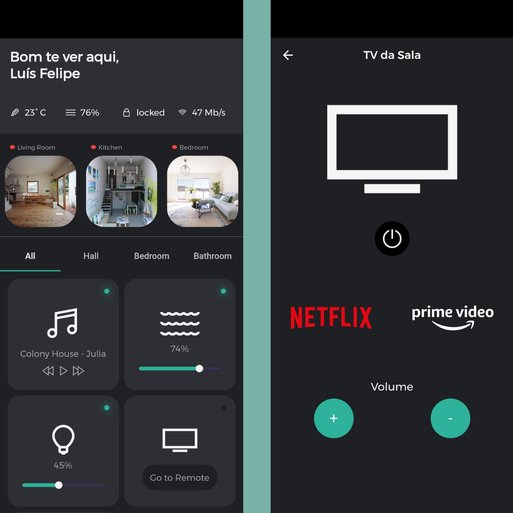

# SmartSmart

Smart Home Manager in he palm of your hand!

### 💻  Requirements:

* Any Operating System (MacOS, Linux, Windows)
* Any IDE with Flutter SDK installed (Android Studio, VSCode etc)
* A little knowledge of Dart and Flutter

 ### 👨‍💻  Author

 - https://github.com/camargolfelipe

# Screenshots:

